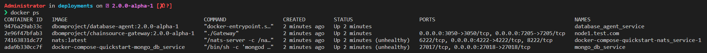

Getting Started
===============

======
Docker
======

This tutorial will describe how to get started with the digital bill of materials using docker. The sample docker-compose file will build and run the required containers to get started.

-  chainsource-gateway
-  database-agent
-  nats
-  mongodb (local - with prisma)
-  notary-agent (local - basic implementation)

Once these containers are running, the DBoM gateway (chainsource-gateway) provides a REST interface with the APIs as described in the `API Specs <https://github.com/DBOMproject/api-specs/tree/2.0.0-alpha-1>`__ 

Prerequisites and setup
------------------------

-  `Docker <https://www.docker.com/products/overview>`__ - v24.0.2 or higher
-  `Docker Compose <https://docs.docker.com/compose/overview/>`__ - v2.19.1 or higher
-  `Git client <https://git-scm.com/downloads>`__ - needed for clone commands

Running the sample program
--------------------------

Terminal Window
~~~~~~~~~~~~~~~

Step 1 
^^^^^^

Clone the `deployments repository <https://github.com/DBOMproject/deployments>`__ check out to `2.0.0-alpha-1` branch and navigate to the `docker-compose-quickstart` folder

.. code-block:: shell

    # Clone the deployments repository
   git clone https://github.com/DBOMproject/deployments.git

   # Checkout to 2.0.0-alpha-1
   git checkout 2.0.0-alpha-1

   # Navigate to the docker-compose-quickstart folder
   cd deployments/docker-compose-quickstart

Step 2
^^^^^^

Launch the network using docker-compose

.. code-block:: shell

   # Generate certificates
   # node1.test.com - should be same as your container/node name
   docker compose -f docker-compose-certs.yml run --rm certificate_generator ./Generator node1.test.com

   # Run all the services
   docker compose up -d

Once you run this command, the images will be built from the source code
and then the containers will be up and running. You can check the status
of the containers by running the following command

.. code-block:: shell

   docker ps

The output of the above command should be like below

Step 3
^^^^^^

Execute the REST API sample requests from the section `Sample REST APIs Requests <#sample-rest-apis-requests>`__

With the containers started, next, test the APIs by executing the script *testAPIs.sh*

.. code-block:: shell

   ./testAPIs.sh

Stopping docker containers
~~~~~~~~~~~~~~~~~~~~~~~~~~

.. code-block:: shell

   # To stop the docker containers
   docker compose down

   # To stop the docker containers, also deletes volumes
   docker compose down -v

   # To stop the docker containers, also deletes images and volumes
   docker compose down --rmi all -v

Sample REST API Requests
------------------------

Node Requests
~~~~~~~~~~~~~

**Get Node 1 _metadata**
^^^^^^^^^^^^^^^^^^^^^^^^^

.. code-block:: shell

   curl --location 'http://localhost:3050/api/v2/nodes/node1.test.com/_metadata' \
   --header 'Accept: application/json'

Output:

.. code-block:: json
   
   {
      "success": true,
      "result": [
         {
            "id": "64ddd903ef1537048d1f6437",
            "nodeId": "node1",
            "publicKeys": [],
            "nodeConnections": [
                  {
                     "nodeId": "node2",
                     "status": "FEDERATION_SUCCESS",
                     "channelConnections": [
                        {
                           "channelId": "channel1",
                           "status": "CONNECTED",
                           "access": "READ"
                        },
                        {
                           "channelId": "channel1",
                           "status": "REQUEST_ACCEPTED",
                           "access": "READ"
                        }
                     ]
                  }
            ],
            "createdAt": "2023-08-17T08:23:31.695Z",
            "modifiedAt": "2023-08-17T08:28:21.234Z"
         }
      ]
   }

Channel Requests
~~~~~~~~~~~~~~~~

**Create Channel1 on Node1**
^^^^^^^^^^^^^^^^^^^^^^^^^^^^

.. code-block:: shell

   curl --location 'http://localhost:3050/api/v2/nodes/node1.test.com/channels' \
   --header 'Content-Type: application/json' \
   --header 'Accept: application/json' \
   --data '{
      "channelId": "channel1",
      "description": "Channel1 of Node 1",
      "type": "TEST_CHANNEL",
      "notaries": []
   }'

Output:

.. code-block:: json

   {
      "success": true,
      "status": "successfully created channel"
   }

**List all Channels on Node1**
^^^^^^^^^^^^^^^^^^^^^^^^^^^^^^^

.. code-block:: shell

   curl --location 'http://localhost:3050/api/v2/nodes/node1.test.com/channels' \
   --header 'Accept: application/json'

Output:

.. code-block:: json
   
   {
      "success": true,
      "result": [
         {
            "channelId": "channel1",
            "description": "Channel1 of Node 1",
            "type": "TEST_CHANNEL",
            "notaries": [],
            "createdAt": "2023-08-17T08:26:45.133Z",
            "modifiedAt": "2023-08-17T08:26:45.133Z"
         }
      ]
   }

**List Channel1 on Node1**
^^^^^^^^^^^^^^^^^^^^^^^^^^

.. code-block:: shell

   curl --location 'http://localhost:3051/api/v2/nodes/node1.test.com/channels/channel1' \
   --header 'Accept: application/json'
Output:

.. code-block:: json
   
   {
      "success": true,
      "result": [
         {
            "channelId": "channel1",
            "description": "Channel1 of Node 1",
            "type": "TEST_CHANNEL",
            "notaries": [],
            "createdAt": "2023-08-17T08:26:45.133Z",
            "modifiedAt": "2023-08-17T08:26:45.133Z"
         }
      ]
   }

**Add a notary to a Channel1 on Node1**
^^^^^^^^^^^^^^^^^^^^^^^^^^^^^^^^^^^^^^^

.. code-block:: shell

   curl --location --request PUT 'http://localhost:3050/api/v2/nodes/node1.test.com/channels/channel1/notary' \
   --header 'Content-Type: application/json' \
   --header 'Accept: application/json' \
   --data '{
   "notaryId": "notary-sample"
   }'

Output:

.. code-block:: json

   {
      "success": true,
      "status": "successfully updated channel notary"
   }

**Remove a notary from a Channel1 on Node1**
^^^^^^^^^^^^^^^^^^^^^^^^^^^^^^^^^^^^^^^^^^^^

.. code-block:: shell

   curl --location --request DELETE 'http://localhost:3050/api/v2/nodes/node1.test.com/channels/channel1/notary/notary-sample' \
   --header 'Accept: application/json'

Output:

.. code-block:: json

   {
      "success": true,
      "status": "successfully removed channel notary"
   }

Asset Requests
~~~~~~~~~~~~~~

**Create Asset1 on Channel1 of Node1**
^^^^^^^^^^^^^^^^^^^^^^^^^^^^^^^^^^^^^^

.. code-block:: shell

   curlcurl --location 'http://localhost:3050/api/v2/nodes/node1.test.com/channels/channel1/assets/asset1' \
   --header 'Content-Type: application/json' \
   --header 'Accept: application/json' \
   --data '{
      "standardVersion": 1,
      "schemaUrl": "https://raw.githubusercontent.com/spdx/spdx-spec/development/v2.3.1/schemas/spdx-schema.json",
      "createdAt": "2023-05-15T12:34:56Z",
      "modifiedAt": "2023-05-15T12:34:56Z",
      "notarizations": [
         {
               "notaryId": "not1",
               "notaryMeta": {}
         }
      ],
      "links": [
         {
               "assetUri": "string",
               "type": "asset",
               "comment": "example2",
               "id": "link1"
         }
      ],
      "signatures": [
         {
               "hashType": "SHA256",
               "signType": "type1",
               "signMeta": {
                  "authority": "user1",
                  "keyId": "12345",
                  "sign": "asdfbiuvagebvbayerfasdfbsjasdfdliufgalsi"
               }
         }
      ],
      "body": {}
   }'

Output:

.. code-block:: json

   {
      "success": true,
      "status": "successfully created asset"
   }

**List Assets on Channel1 of Node1**
^^^^^^^^^^^^^^^^^^^^^^^^^^^^^^^^^^^^

.. code-block:: shell

   curl --location 'http://localhost:3050/api/v2/nodes/node1.test.com/channels/channel1/assets' \
   --header 'Content-Type: application/json' \
   --header 'Accept: application/json' \
   --data ''

Output:

.. code-block:: json

   {
      "success": true,
      "result": [
         {
            "channelId": "channel1",
            "assetId": "asset1",
            "payload": {
               "standardVersion": 1,
               "schemaUrl": "https://raw.githubusercontent.com/spdx/spdx-spec/development/v2.3.1/schemas/spdx-schema.json",
               "createdAt": "2023-05-15T12:34:56Z",
               "modifiedAt": "2023-05-15T12:34:56Z",
               "notarizations": [
                  {
                     "notaryId": "not1",
                     "notaryMeta": {}
                  }
               ],
               "links": [
                  {
                     "assetUri": "string",
                     "type": "asset",
                     "comment": "example2",
                     "id": "link1"
                  }
               ],
               "signatures": [
                  {
                     "hashType": "SHA256",
                     "signType": "type1",
                     "signMeta": {
                           "authority": "user1",
                           "keyId": "12345",
                           "sign": "asdfbiuvagebvbayerfasdfbsjasdfdliufgalsi"
                     }
                  }
               ],
               "body": {}
            }
         }
      ]
   }

**List Asset1 on Channel1 of Node1**
^^^^^^^^^^^^^^^^^^^^^^^^^^^^^^^^^^^^

.. code-block:: shell

   curl --location 'http://localhost:3050/api/v2/nodes/node1.test.com/channels/channel1/assets/asset1' \
   --header 'Accept: application/json'

Output:

.. code-block:: json

   {
      "success": true,
      "result": [
         {
            "channelId": "channel1",
            "assetId": "asset1",
            "payload": {
               "standardVersion": 1,
               "schemaUrl": "https://raw.githubusercontent.com/spdx/spdx-spec/development/v2.3.1/schemas/spdx-schema.json",
               "createdAt": "2023-05-15T12:34:56Z",
               "modifiedAt": "2023-05-15T12:34:56Z",
               "notarizations": [
                  {
                     "notaryId": "not1",
                     "notaryMeta": {}
                  }
               ],
               "links": [
                  {
                     "assetUri": "string",
                     "type": "asset",
                     "comment": "example2",
                     "id": "link1"
                  }
               ],
               "signatures": [
                  {
                     "hashType": "SHA256",
                     "signType": "type1",
                     "signMeta": {
                           "authority": "user1",
                           "keyId": "12345",
                           "sign": "asdfbiuvagebvbayerfasdfbsjasdfdliufgalsi"
                     }
                  }
               ],
               "body": {}
            }
         }
      ]
   }

**Update Asset1 on Channel1 of Node1**
^^^^^^^^^^^^^^^^^^^^^^^^^^^^^^^^^^^^^^

.. code-block:: shell

   curl --location --request PUT 'http://localhost:3050/api/v2/nodes/node1.test.com/channels/channel1/assets/asset1' \
   --header 'Content-Type: application/json' \
   --data '{
      "standardVersion": 1,
      "schemaUrl": "https://raw.githubusercontent.com/spdx/spdx-spec/development/v2.3.1/schemas/spdx-schema.json",
      "createdAt": "2023-05-15T12:34:56Z",
      "modifiedAt": "2023-05-15T12:34:56Z",
      "notarizations": [
         {
               "notaryId": "not1",
               "notaryMeta": {}
         },
         {
               "notaryId": "not2",
               "notaryMeta": {}
         }
      ],
      "links": [
         {
               "assetUri": "string",
               "type": "asset",
               "comment": "example2",
               "id": "id4"
         }
      ],
      "signatures": [
         {
               "hashType": "SHA256",
               "signType": "type1",
               "signMeta": {
                  "authority": "user1",
                  "keyId": "12345",
                  "sign": "Xdjfgfn"
               }
         }
      ],
      "body": {}
   }'

Output:

.. code-block:: json

   {
      "success": true,
      "status": "successfully updated asset"
   }

** Rich Query Assets in Channel1 of Node1**
^^^^^^^^^^^^^^^^^^^^^^^^^^^^^^^^^^^^^^^^^^

.. code-block:: shell

 curl --location --globoff 'http://localhost:3050/api/v2/nodes/node1.test.com/channels/channel1/assets/_query?query={%20}&fields=[]&limit=1&skip=0'

.. note::
   Refer postman API collation for more details on query.

Output:

.. code-block:: json

   {
      "success": true,
      "result": [
         {
            "channelId": "channel1",
            "assetId": "asset1",
            "payload": {
               "standardVersion": 1,
               "schemaUrl": "https://raw.githubusercontent.com/spdx/spdx-spec/development/v2.3.1/schemas/spdx-schema.json",
               "createdAt": "2023-05-15T12:34:56Z",
               "modifiedAt": "2023-05-15T12:34:56Z",
               "notarizations": [
                  {
                     "notaryId": "not1",
                     "notaryMeta": {}
                  },
                  {
                     "notaryId": "not2",
                     "notaryMeta": {}
                  }
               ],
               "links": [
                  {
                     "assetUri": "string",
                     "type": "asset",
                     "comment": "example2",
                     "id": "id4"
                  }
               ],
               "signatures": [
                  {
                     "hashType": "SHA256",
                     "signType": "type1",
                     "signMeta": {
                        "authority": "user1",
                        "keyId": "12345",
                        "sign": "Xdjfgfn"
                     }
                  }
               ],
               "body": {}
            }
         }
      ]
   }

**Query Assets in Channel1 of Node1**
^^^^^^^^^^^^^^^^^^^^^^^^^^^^^^^^^^^^^

.. code-block:: shell

   curl --location 'http://localhost:3050/api/v2/nodes/node1.test.com/channels/channel1/assets/_query' \
   --header 'Content-Type: application/json' \
   --data '{
      "where": {
         "assetId": {
               "equals": "asset1"
         }
      }
   }'

Output:

.. code-block:: json

   {
      "success": true,
      "result": [
         {
            "channelId": "channel1",
            "assetId": "asset1",
            "payload": {
               "standardVersion": 1,
               "schemaUrl": "https://raw.githubusercontent.com/spdx/spdx-spec/development/v2.3.1/schemas/spdx-schema.json",
               "createdAt": "2023-05-15T12:34:56Z",
               "modifiedAt": "2023-05-15T12:34:56Z",
               "notarizations": [
                  {
                     "notaryId": "not1",
                     "notaryMeta": {}
                  },
                  {
                     "notaryId": "not2",
                     "notaryMeta": {}
                  }
               ],
               "links": [
                  {
                     "assetUri": "string",
                     "type": "asset",
                     "comment": "example2",
                     "id": "id4"
                  }
               ],
               "signatures": [
                  {
                     "hashType": "SHA256",
                     "signType": "type1",
                     "signMeta": {
                           "authority": "user1",
                           "keyId": "12345",
                           "sign": "Xdjfgfn"
                     }
                  }
               ],
               "body": {}
            }
         }
      ]
   }

**Audit Trail of Asset1 in Channel1 of Node1**
^^^^^^^^^^^^^^^^^^^^^^^^^^^^^^^^^^^^^^^^^^^^^^

.. code-block:: shell

   curl --location 'http://localhost:3050/api/v2/nodes/node1.example.com/channels/channel1/assets/asset1/audit-trail' \
   --header 'Accept: application/json'

Output:

.. code-block:: json

   {
      "success": true,
      "result": [
         {
            "id": "64ddd9d4ef1537048d1f643a",
            "channelId": "channel1",
            "assetId": "asset1",
            "action": "CREATE",
            "payload": {
               "assetId": "asset1",
               "channelId": "channel1",
               "createdAt": "2023-08-17T08:27:00.909Z",
               "id": "64ddd9d4ef1537048d1f6439",
               "modifiedAt": "2023-08-17T08:27:00.909Z",
               "payload": {
                  "body": {},
                  "createdAt": "2023-05-15T12:34:56Z",
                  "links": [
                     {
                           "assetUri": "string",
                           "comment": "example2",
                           "id": "link1",
                           "type": "asset"
                     }
                  ],
                  "modifiedAt": "2023-05-15T12:34:56Z",
                  "notarizations": [
                     {
                           "notaryId": "not1",
                           "notaryMeta": {}
                     }
                  ],
                  "schemaUrl": "https://raw.githubusercontent.com/spdx/spdx-spec/development/v2.3.1/schemas/spdx-schema.json",
                  "signatures": [
                     {
                           "hashType": "SHA256",
                           "signMeta": {
                              "authority": "user1",
                              "keyId": "12345",
                              "sign": "asdfbiuvagebvbayerfasdfbsjasdfdliufgalsi"
                           },
                           "signType": "type1"
                     }
                  ],
                  "standardVersion": 1
               }
            },
            "timestamp": "2023-08-17T08:27:00.914Z"
         },
         {
            "id": "64ddf2c6b7b6a73ae0cd6ead",
            "channelId": "channel1",
            "assetId": "asset1",
            "action": "UPDATE",
            "payload": {
               "body": {},
               "createdAt": "2023-05-15T12:34:56Z",
               "links": [
                  {
                     "assetUri": "string",
                     "comment": "example2",
                     "id": "id4",
                     "type": "asset"
                  }
               ],
               "modifiedAt": "2023-05-15T12:34:56Z",
               "notarizations": [
                  {
                     "notaryId": "not1",
                     "notaryMeta": {}
                  },
                  {
                     "notaryId": "not2",
                     "notaryMeta": {}
                  }
               ],
               "schemaUrl": "https://raw.githubusercontent.com/spdx/spdx-spec/development/v2.3.1/schemas/spdx-schema.json",
               "signatures": [
                  {
                     "hashType": "SHA256",
                     "signMeta": {
                           "authority": "user1",
                           "keyId": "12345",
                           "sign": "Xdjfgfn"
                     },
                     "signType": "type1"
                  }
               ],
               "standardVersion": 1
            },
            "timestamp": "2023-08-17T10:13:26.357Z"
         },
         {
            "id": "64ddf4efb7b6a73ae0cd6eae",
            "channelId": "channel1",
            "assetId": "asset1",
            "action": "LINK",
            "payload": {
               "assetId": "asset1",
               "channelId": "channel1",
               "createdAt": "2023-08-17T08:27:00.909Z",
               "id": "64ddd9d4ef1537048d1f6439",
               "modifiedAt": "2023-08-17T10:22:39.313Z",
               "payload": {
                  "body": {},
                  "createdAt": "2023-05-15T12:34:56Z",
                  "links": [
                     {
                           "assetUri": "string",
                           "comment": "example2",
                           "id": "id4",
                           "type": "asset"
                     },
                     {
                           "assetUri": "reprehenderit qui culpa deserunt velit",
                           "comment": "si",
                           "id": "link2",
                           "type": "amet dolore enim velit"
                     }
                  ],
                  "modifiedAt": "2023-05-15T12:34:56Z",
                  "notarizations": [
                     {
                           "notaryId": "not1",
                           "notaryMeta": {}
                     },
                     {
                           "notaryId": "not2",
                           "notaryMeta": {}
                     }
                  ],
                  "schemaUrl": "https://raw.githubusercontent.com/spdx/spdx-spec/development/v2.3.1/schemas/spdx-schema.json",
                  "signatures": [
                     {
                           "hashType": "SHA256",
                           "signMeta": {
                              "authority": "user1",
                              "keyId": "12345",
                              "sign": "Xdjfgfn"
                           },
                           "signType": "type1"
                     }
                  ],
                  "standardVersion": 1
               }
            },
            "timestamp": "2023-08-17T10:22:39.325Z"
         }
      ]
   }

**Add Link1 to Asset1 in Channel1 of Node1**
^^^^^^^^^^^^^^^^^^^^^^^^^^^^^^^^^^^^^^^^^^^^

.. code-block:: shell

   curl --location 'http://localhost:3050/api/v2/nodes/node1.example.com/channels/channel1/assets/asset1/links' \
   --header 'Content-Type: application/json' \
   --data '{
   "assetUri": "dbom://node1.test.com/nodes/node2.test.com/channels/channel1/assets/asset2",
   "type": "DEPENDENT_ON",
   "comment": "adding link",
   "id": "link2"
   }'

Output:

.. code-block:: json

   {
      "success": true,
      "status": "successfully linked asset"
   }

**Remove Link1 to Asset1 in Channel1 of Node1**
^^^^^^^^^^^^^^^^^^^^^^^^^^^^^^^^^^^^^^^^^^^^^^^

.. code-block:: shell

   curl --location --request DELETE 'http://localhost:3050/api/v2/nodes/node1.test.com/channels/channel1/assets/asset1/links/link2'

Output:

.. code-block:: json

   {
      "success": true,
      "status": "successfully unlinked asset"
   }

Federation Requests
~~~~~~~~~~~~~~~~~~~

.. note:: 
    **Requires another running DBoM node to work**. Below requests and responses work when Node2 is running with respective channels associated with it. 

**Access Channel2 of Node2 on Node1 (Initiates Channel Join Request)**
^^^^^^^^^^^^^^^^^^^^^^^^^^^^^^^^^^^^^^^^^^^^^^^^^^^^^^^^^^^^^^^^^^^^^^

.. code-block:: shell

   curl --location 'http://localhost:3050/api/v2/nodes/node2.test.com/channels/channel1' \
   --header 'Accept: application/json'

Output:

.. code-block:: json

   {
      "status": "successfully created federation request",
      "success": true
   }

**Check Channel Join Request Status in Node1 Metadata**
^^^^^^^^^^^^^^^^^^^^^^^^^^^^^^^^^^^^^^^^^^^^^^^^^^^^^^^

.. code-block:: shell

   curl --location 'http://localhost:3050/api/v2/nodes/node1.test.com/_metadata' \
   --header 'Accept: application/json'

Output:

.. code-block:: json

   {
      "success": true,
      "result": [
         {
            "id": "64ddd903ef1537048d1f6437",
            "nodeId": "node1",
            "publicKeys": [],
            "nodeConnections": [
               {
                  "nodeId": "node2",
                  "status": "FEDERATION_SUCCESS",
                  "channelConnections": [
                     {
                        "channelId": "channel1",
                        "status": "SENT_CONNECTION_REQUEST",
                        "access": "READ"
                     }
                  ]
               }
            ],
            "createdAt": "2023-08-17T08:23:31.695Z",
            "modifiedAt": "2023-08-17T08:28:21.234Z"
         }
      ]
   } 

**Check Channel Join Request Status in Node1 Metadata**
^^^^^^^^^^^^^^^^^^^^^^^^^^^^^^^^^^^^^^^^^^^^^^^^^^^^^^^

.. code-block:: shell

   curl --location 'http://localhost:3051/api/v2/nodes/node2.test.com/_metadata' \
   --header 'Accept: application/json'

Output:

.. code-block:: json

      {
         "success": true,
         "result": [
            {
               "id": "64ddd9039ddeb7835e1bc976",
               "nodeId": "node2",
               "publicKeys": [],
               "nodeConnections": [
                  {
                     "nodeId": "node1",
                     "status": "FEDERATION_SUCCESS",
                     "channelConnections": [
                        {
                           "channelId": "channel1",
                           "status": "RECEIVED_CONNECTION_REQUEST",
                           "access": "READ"
                        }
                     ]
                  }
               ],
               "createdAt": "2023-08-17T08:23:31.357Z",
               "modifiedAt": "2023-08-17T10:39:39.158Z"
            }
         ]
      }

**Check Requests on Node2**
^^^^^^^^^^^^^^^^^^^^^^^^^^^

.. code-block:: shell

   curl --location 'http://localhost:3051/api/v2/federation/requests/all'

Output:

.. code-block:: json

   {
      "success": true,
      "result": [
         {
            "requestId": "64ddf8eba4acb883b830ad7d",
            "nodeUri": "node1.test.com",
            "nodeId": "node1",
            "channelId": "channel1",
            "status": "AWAITING_ACTION",
            "createdAt": "2023-08-17T10:39:39.184Z",
            "modifiedAt": "2023-08-17T10:39:39.184Z"
         }
      ]
   }

**Check specific Request on Node2 with RequestId**
^^^^^^^^^^^^^^^^^^^^^^^^^^^^^^^^^^^^^^^^^^^^^^^^^^

.. code-block:: shell

   curl --location 'http://localhost:3051/api/v2/federation/requests/64ddf8eba4acb883b830ad7d'

Output:

.. code-block:: json

   {
      "success": true,
      "result": [
         {
            "requestId": "64ddf8eba4acb883b830ad7d",
            "nodeUri": "node1.test.com",
            "nodeId": "node1",
            "channelId": "channel1",
            "status": "AWAITING_ACTION",
            "createdAt": "2023-08-17T10:39:39.184Z",
            "modifiedAt": "2023-08-17T10:39:39.184Z"
         }
      ]
   }

**Accept Channel1 Access request on Node2**
^^^^^^^^^^^^^^^^^^^^^^^^^^^^^^^^^^^^^^^^^^^

.. code-block:: shell

   curl --location 'http://localhost:3051/api/v2/federation/requests/64ddf8eba4acb883b830ad7d/accept' \
   --header 'Content-Type: application/json' \
   --data '{
      "type": "ACCEPT"
   }'

Output:

.. code-block:: json

   {
      "success": true,
      "status": "successfully accepted federation request"
   }

**Reject Channel1 Access request on Node2**
^^^^^^^^^^^^^^^^^^^^^^^^^^^^^^^^^^^^^^^^^^^

.. code-block:: shell

   curl --location 'http://localhost:3051/api/v2/federation/requests/64ddf8eba4acb883b830ad7d/reject' \
   --header 'Content-Type: application/json' \
   --data '{
      "type": "REJECT"
   }'

Output:

.. code-block:: json

   {
      "success": true,
      "status": "successfully rejected federation request"
   }

**Revoke Channel1 Access request on Node2**
^^^^^^^^^^^^^^^^^^^^^^^^^^^^^^^^^^^^^^^^^^^

.. code-block:: shell

   curl --location 'http://localhost:3050/api/v2/federation/revoke' \
   --header 'Content-Type: application/json' \
   --data '{
      "nodeUri": "node2.test.com",
      "nodeId": "node2",
      "channelId": "channel2",
      "type": "REVOKE"
   }'

Output:

.. code-block:: json

   {
      "success": true,
      "status": "successfully revoked access"
   }

**Access Channel1 of Node2 on Node1 (After Channel Join Request is accepted)**
^^^^^^^^^^^^^^^^^^^^^^^^^^^^^^^^^^^^^^^^^^^^^^^^^^^^^^^^^^^^^^^^^^^^^^^^^^^^^^

.. code-block:: shell

   curl --location 'http://localhost:3050/api/v2/nodes/node2.test.com/channels/channel1' \
   --header 'Accept: application/json'

Output:

.. code-block:: json

   {
    "success": true,
    "result": [
         {
            "channelId": "channel1",
            "description": "Channel1 of Node 2 - Remote",
            "type": "TEST_CHANNEL",
            "notaries": [],
            "createdAt": "2023-08-17T08:26:55.626Z",
            "modifiedAt": "2023-08-17T08:26:55.626Z"
         }
      ]
   }

**Access Assets of Channel1 of Node2 from Node1 (After Channel Join Request is accepted)**
^^^^^^^^^^^^^^^^^^^^^^^^^^^^^^^^^^^^^^^^^^^^^^^^^^^^^^^^^^^^^^^^^^^^^^^^^^^^^^

.. code-block:: shell

   curl --location 'http://localhost:3050/api/v2/nodes/node2.test.com/channels/channel1/assets' \
   --header 'Content-Type: application/json' \
   --header 'Accept: application/json' \
   --data ''

Output:

.. code-block:: json

   {
      "success": true,
      "result": [
         {
            "channelId": "channel1",
            "assetId": "asset1",
            "payload": {
               "standardVersion": 1,
               "schemaUrl": "https://raw.githubusercontent.com/spdx/spdx-spec/development/v2.3.1/schemas/spdx-schema.json",
               "createdAt": "2023-05-15T12:34:56Z",
               "modifiedAt": "2023-05-15T12:34:56Z",
               "notarizations": [
                  {
                     "notaryId": "not1",
                     "notaryMeta": {}
                  }
               ],
               "links": [
                  {
                     "assetUri": "string",
                     "type": "asset",
                     "comment": "example2",
                     "id": "link1"
                  }
               ],
               "signatures": [
                  {
                     "hashType": "SHA256",
                     "signType": "type1",
                     "signMeta": {
                           "authority": "user1",
                           "keyId": "12345",
                           "sign": "asdfbiuvagebvbayerfasdfbsjasdfdliufgalsi"
                     }
                  }
               ],
               "body": {}
            }
         }
      ]
   }

================
[WIP] Kubernetes
================

Work in progress. 

.. Learn how to deploy each service using helm using the READMEs provided in the `deployments repository <https://github.com/DBOMproject/deployments>`__
