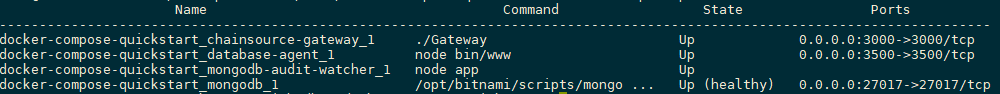

Getting Started
===============

======
Docker
======

This tutorial will describe how to get started with the digital bill of materials using docker. The sample docker-compose file will build and run 3 containers viz.

-  chainsource-gateway
-  database-agent
-  mongodb

Once these containers are running, the Chainsource gateway provides a REST interface with the APIs as described in the `API Specs`.

Prerequisites and setup
------------------------

-  `Docker <https://www.docker.com/products/overview>`__ - v18.0 or higher
-  `Docker Compose <https://docs.docker.com/compose/overview/>`__ - v1.25.0 or higher
-  `Git client <https://git-scm.com/downloads>`__ - needed for clone commands

Running the sample program
--------------------------

Terminal Window
~~~~~~~~~~~~~~~

Step 1
^^^^^^

Clone the `deployments repository <https://github.com/DBOMproject/deployments>`__ and navigate to the docker-compose-quickstart folder

::

    git clone https://github.com/DBOMproject/deployments.git
    cd deployments/docker-compose-quickstart

Step 2
^^^^^^

Launch the network using docker-compose

::

   docker-compose -f docker-compose.yaml up -d --build

Once you run this command, the images will be built from the source code
and then the containers will be up and running. You can check the status
of the containers by running the following command

::

   docker ps

The output of the above command should be like below

Step 3
^^^^^^

Execute the REST API sample requests from the section `Sample REST APIs Requests <#sample-rest-apis-requests>`__

With the containers started, next, test the APIs by executing the script *testAPIs.sh*

::

   ./testAPIs.sh

Sample REST API Requests
-------------------------

Create Asset Requests
~~~~~~~~~~~~~~~~~~~~~

Create Asset-7991 on Channel C1

::

   curl -f --location --request POST "http://localhost:3000/api/v1/repo/DB1/chan/C1/asset/Asset-7991" \
   --header 'Content-Type: application/json' \
   --data-raw '{
       "standardVersion": 1.0,
       "documentName": "Test Asset 01",
       "documentCreator": "DBoM Organisation",
       "documentCreatedDate": "2020-10-01T10:06:47+0000",
       "assetType": "HardwareComponent",
       "assetSubType": "SubType1",
       "assetManufacturer": "DBoM Organisation",
       "assetModelNumber": "ABCXYZ",
       "assetDescription": "A DBoM Asset",
       "assetMetadata": {  
           "aKey": "aValue"
       },
       "manufactureSignature": "UNSIGNED(TEST)"
   }'

**Output:**

.. code-block:: json

   {
       "success":true,
       "status":"Successfully created on the agent"
   }

-  Create Asset-7992 on Channel C1

::

   curl -f --location --request POST "http://localhost:3000/api/v1/repo/DB1/chan/C1/asset/Asset-7992" \
   --header 'Content-Type: application/json' \
   --data-raw '{
       "standardVersion": 1.0,
       "documentName": "Test Asset 02",
       "documentCreator": "DBoM Organisation",
       "documentCreatedDate": "2020-10-01T10:06:47+0000",
       "assetType": "HardwareComponent",
       "assetSubType": "SubType1",
       "assetManufacturer": "DBoM Organisation",
       "assetModelNumber": "ABCXYZ",
       "assetDescription": "A DBoM Asset",
       "assetMetadata": {  
           "aKey": "aValue"
       },
       "manufactureSignature": "UNSIGNED(TEST)"
   }'

**Output:**

.. code-block:: json

   {
       "success":true,
       "status":"Successfully created on the agent"
   }

Retrive Asset Requests
~~~~~~~~~~~~~~~~~~~~~~

Retrieve Asset-7992 from Channel C1

::

   curl -f --location --request GET "http://localhost:3000/api/v1/repo/DB1/chan/C1/asset/Asset-7992" 

**Output:**

.. code-block:: json

   {
       "standardVersion": 1,
       "documentName": "Test Asset 02",
       "documentCreator": "DBoM Organisation",
       "documentCreatedDate": "2020-10-01T10:06:47+0000",
       "assetType": "HardwareComponent",
       "assetSubType": "SubType1",
       "assetManufacturer": "DBoM Organisation",
       "assetModelNumber": "ABCXYZ",
       "assetDescription": "A DBoM Asset",
       "assetMetadata": {
           "aKey": "aValue"
       },
       "parentAsset": {
           "repoID": "",
           "channelID": "",
           "assetID": "",
           "role": "",
           "subRole": ""
       },
       "manufactureSignature": "UNSIGNED(TEST)"
   }

Update Asset Requests
~~~~~~~~~~~~~~~~~~~~~

Update Asset-7991 on Channel C1

::

   curl -f --location --request PUT "http://localhost:3000/api/v1/repo/DB1/chan/C1/asset/Asset-7991" \
   --header 'Content-Type: application/json' \
   --data-raw '{
       "standardVersion": 1.0,
       "documentName": "Test Asset 01 Updated",
       "documentCreator": "DBoM Organisation",
       "documentCreatedDate": "2020-10-01T10:06:47+0000",
       "assetType": "HardwareComponent",
       "assetSubType": "SubType1",
       "assetManufacturer": "DBoM Organisation",
       "assetModelNumber": "ABCXYZ",
       "assetDescription": "A DBoM Asset",
       "assetMetadata": {  
           "aKey": "aValue"
       },
       "manufactureSignature": "UNSIGNED(TEST)"
   }'

**Output:**

.. code-block:: json

   {
       "success":true,
       "status":"Successfully updated on the agent"
   }

Retrieve Asset-7991 from Channel C1

::

   curl -f --location --request GET "http://localhost:3000/api/v1/repo/DB1/chan/C1/asset/Asset-7991" 

**Output:**

.. code-block:: json

   {
       "standardVersion": 1,
       "documentName": "Test Asset 01 Updated",
       "documentCreator": "DBoM Organisation",
       "documentCreatedDate": "2020-10-01T10:06:47+0000",
       "assetType": "HardwareComponent",
       "assetSubType": "SubType1",
       "assetManufacturer": "DBoM Organisation",
       "assetModelNumber": "ABCXYZ",
       "assetDescription": "A DBoM Asset",
       "assetMetadata": {
           "aKey": "aValue"
       },
       "parentAsset": {
           "repoID": "",
           "channelID": "",
           "assetID": "",
           "role": "",
           "subRole": ""
       },
       "manufactureSignature": "UNSIGNED(TEST)"
   }

Attach and Detach Requests
~~~~~~~~~~~~~~~~~~~~~~~~~~

-  Attaching Asset-7992 [Parent] to Asset-7991 [Child]

::

   curl -f --location --request POST "http://localhost:3000/api/v1/repo/DB1/chan/C1/asset/Asset-7992/attach" \
   --header 'Content-Type: application/json' \
   --data-raw "{
      \"role\": \"SomeRole\",
      \"subRole\": \"SomeSubRole\",
      \"repoID\": \"DB1\",
      \"channelID\": \"C1\",
      \"assetID\": \"Asset-7991\"
   }"

**Output:**

.. code-block:: json

   {
       "success": true,
       "status": "Successfully attached on agent"
   }

-  Detaching Asset-7992 [Parent] from Asset-7991 [Child]

::

   curl -f --location --request POST "http://localhost:3000/api/v1/repo/DB1/chan/C1/asset/Asset-7992/detach" \
   --header 'Content-Type: application/json' \
   --data-raw "{
      \"repoID\": \"DB1\",
      \"channelID\": \"C1\",
      \"assetID\": \"Asset-7991\"
   }"

**Output:**

.. code-block:: json

   {
       "success": true,
       "status": "Successfully detached on agent"
   }

-  Attaching Asset-7991 [Parent] from Asset-7992 [Child]

::

   curl -f --location --request POST "http://localhost:3000/api/v1/repo/DB1/chan/C1/asset/Asset-7991/attach" \
   --header 'Content-Type: application/json' \
   --data-raw "{
      \"role\": \"SomeRole\",
      \"subRole\": \"SomeSubRole\",
      \"repoID\": \"DB1\",
      \"channelID\": \"C1\",
      \"assetID\": \"Asset-7992\"
   }"

**Output:**

.. code-block:: json

   {
       "success": true,
       "status": "Successfully attached on agent"
   }

Transfer Asset Requests
~~~~~~~~~~~~~~~~~~~~~~~

Transfer Asset Asset-7991 from Channel C1 to Channel C2

::

   curl --location --request POST "http://localhost:3000/api/v1/repo/DB1/chan/C1/asset/Asset-7991/transfer" \
   --header 'Content-Type: application/json' \
   --data-raw "{
      \"transferDescription\": \"transferred\",
      \"repoID\": \"DB1\",
      \"channelID\": \"C2\",
      \"assetID\": \"Asset-7991\"
   }"

**Output:**

.. code-block:: json

   {
       "success": true,
       "status": "Successfully transferred asset"
   }

Audit Trail Requests
~~~~~~~~~~~~~~~~~~~~~

Channel C1 (pre transfer)

::

   curl -f --location --request GET "http://localhost:3000/api/v1/repo/DB1/chan/C1/asset/Asset-7991/trail"

**Output:**

.. code-block:: json

   {
       "history": [
           {
               "_id": "5f7ab8e27ea2709fad6d6183",
               "channelID": "C1",
               "eventType": "CREATE",
               "payload": {
                   "assetDescription": "A DBoM Asset",
                   "assetManufacturer": "DBoM Organisation",
                   "assetMetadata": {
                       "aKey": "aValue"
                   },
                   "assetModelNumber": "ABCXYZ",
                   "assetSubType": "SubType1",
                   "assetType": "HardwareComponent",
                   "documentCreatedDate": "2020-10-01T10:06:47+0000",
                   "documentCreator": "DBoM Organisation",
                   "documentName": "Test Asset 01",
                   "manufactureSignature": "UNSIGNED(TEST)",
                   "parentAsset": {
                       "assetID": "",
                       "channelID": "",
                       "repoID": "",
                       "role": "",
                       "subRole": ""
                   },
                   "standardVersion": 1
               },
               "resourceID": "Asset-7991",
               "timestamp": "2020-10-05T06:10:42.159Z"
           },
           {
               "_id": "5f7ab8e87ea27019956d6185",
               "channelID": "C1",
               "eventType": "UPDATE",
               "payload": {
                   "assetDescription": "A DBoM Asset",
                   "assetManufacturer": "DBoM Organisation",
                   "assetMetadata": {
                       "aKey": "aValue"
                   },
                   "assetModelNumber": "ABCXYZ",
                   "assetSubType": "SubType1",
                   "assetType": "HardwareComponent",
                   "documentCreatedDate": "2020-10-01T10:06:47+0000",
                   "documentCreator": "DBoM Organisation",
                   "documentName": "Test Asset 01 Updated",
                   "manufactureSignature": "UNSIGNED(TEST)",
                   "parentAsset": {
                       "assetID": "",
                       "channelID": "",
                       "repoID": "",
                       "role": "",
                       "subRole": ""
                   },
                   "standardVersion": 1
               },
               "resourceID": "Asset-7991",
               "timestamp": "2020-10-05T06:10:48.268Z"
           },
           {
               "_id": "5f7ab8ec7ea270a69f6d6187",
               "channelID": "C1",
               "eventType": "ATTACH",
               "payload": {
                   "assetDescription": "A DBoM Asset",
                   "assetManufacturer": "DBoM Organisation",
                   "assetMetadata": {
                       "aKey": "aValue"
                   },
                   "assetModelNumber": "ABCXYZ",
                   "assetSubType": "SubType1",
                   "assetType": "HardwareComponent",
                   "documentCreatedDate": "2020-10-01T10:06:47+0000",
                   "documentCreator": "DBoM Organisation",
                   "documentName": "Test Asset 01 Updated",
                   "manufactureSignature": "UNSIGNED(TEST)",
                   "parentAsset": {
                       "assetID": "Asset-7992",
                       "channelID": "C1",
                       "repoID": "DB1",
                       "role": "SomeRole",
                       "subRole": "SomeSubRole"
                   },
                   "standardVersion": 1
               },
               "resourceID": "Asset-7991",
               "timestamp": "2020-10-05T06:10:52.306Z"
           },
           {
               "_id": "5f7ab8ee7ea2705afd6d6189",
               "channelID": "C1",
               "eventType": "DETACH",
               "payload": {
                   "assetDescription": "A DBoM Asset",
                   "assetManufacturer": "DBoM Organisation",
                   "assetMetadata": {
                       "aKey": "aValue"
                   },
                   "assetModelNumber": "ABCXYZ",
                   "assetSubType": "SubType1",
                   "assetType": "HardwareComponent",
                   "documentCreatedDate": "2020-10-01T10:06:47+0000",
                   "documentCreator": "DBoM Organisation",
                   "documentName": "Test Asset 01 Updated",
                   "manufactureSignature": "UNSIGNED(TEST)",
                   "parentAsset": {
                       "assetID": "",
                       "channelID": "",
                       "repoID": "",
                       "role": "",
                       "subRole": ""
                   },
                   "standardVersion": 1
               },
               "resourceID": "Asset-7991",
               "timestamp": "2020-10-05T06:10:54.329Z"
           },
           {
               "_id": "5f7ab8f07ea27072ab6d618a",
               "channelID": "C1",
               "eventType": "ATTACH",
               "payload": {
                   "assetDescription": "A DBoM Asset",
                   "assetManufacturer": "DBoM Organisation",
                   "assetMetadata": {
                       "aKey": "aValue"
                   },
                   "assetModelNumber": "ABCXYZ",
                   "assetSubType": "SubType1",
                   "assetType": "HardwareComponent",
                   "attachedChildren": [
                       {
                           "assetID": "Asset-7992",
                           "channelID": "C1",
                           "repoID": "DB1",
                           "role": "SomeRole",
                           "subRole": "SomeSubRole"
                       }
                   ],
                   "documentCreatedDate": "2020-10-01T10:06:47+0000",
                   "documentCreator": "DBoM Organisation",
                   "documentName": "Test Asset 01 Updated",
                   "manufactureSignature": "UNSIGNED(TEST)",
                   "parentAsset": {
                       "assetID": "",
                       "channelID": "",
                       "repoID": "",
                       "role": "",
                       "subRole": ""
                   },
                   "standardVersion": 1
               },
               "resourceID": "Asset-7991",
               "timestamp": "2020-10-05T06:10:56.349Z"
           },
           {
               "_id": "5f7ab8f27ea2707a3e6d618c",
               "channelID": "C1",
               "eventType": "TRANSFER",
               "payload": {
                   "assetDescription": "A DBoM Asset",
                   "assetManufacturer": "DBoM Organisation",
                   "assetMetadata": {
                       "aKey": "aValue"
                   },
                   "assetModelNumber": "ABCXYZ",
                   "assetSubType": "SubType1",
                   "assetType": "HardwareComponent",
                   "attachedChildren": [
                       {
                           "assetID": "Asset-7992",
                           "channelID": "C1",
                           "repoID": "DB1",
                           "role": "SomeRole",
                           "subRole": "SomeSubRole"
                       }
                   ],
                   "custodyTransferEvents ": [
                       {
                           "destinationAssetID": "Asset-7991",
                           "destinationChannelID": "C2",
                           "destinationRepoID": "DB1",
                           "sourceAssetID": "Asset-7991",
                           "sourceChannelID": "C1",
                           "sourceRepoID": "DB1",
                           "timestamp": "2020-10-05T06:10:58.371Z",
                           "transferDescription": "transferred"
                       }
                   ],
                   "documentCreatedDate": "2020-10-01T10:06:47+0000",
                   "documentCreator": "DBoM Organisation",
                   "documentName": "Test Asset 01 Updated",
                   "manufactureSignature": "UNSIGNED(TEST)",
                   "parentAsset": {
                       "assetID": "",
                       "channelID": "",
                       "repoID": "",
                       "role": "",
                       "subRole": ""
                   },
                   "readOnly": true,
                   "standardVersion": 1
               },
               "resourceID": "Asset-7991",
               "timestamp": "2020-10-05T06:10:58.373Z"
           }
       ]
   }

Asset Export Requests
~~~~~~~~~~~~~~~~~~~~~

Export asset graph from Asset-7991, now transferred to C2

::

   curl -f --location --request GET "http://localhost:3000/api/v1/repo/DB1/chan/C2/asset/Asset-7991/export"

**Output:**

.. code-block:: json

   {
       "Asset-7991": {
           "standardVersion": 1,
           "documentName": "Test Asset 01 Updated",
           "documentCreator": "DBoM Organisation",
           "documentCreatedDate": "2020-10-01T10:06:47+0000",
           "assetType": "HardwareComponent",
           "assetSubType": "SubType1",
           "assetManufacturer": "DBoM Organisation",
           "assetModelNumber": "ABCXYZ",
           "assetDescription": "A DBoM Asset",
           "assetMetadata": {
               "aKey": "aValue"
           },
           "custodyTransferEvents ": [
               {
                   "timestamp": "2020-10-05T06:10:58.371Z",
                   "transferDescription": "transferred",
                   "sourceRepoID": "DB1",
                   "sourceChannelID": "C1",
                   "sourceAssetID": "Asset-7991",
                   "destinationRepoID": "DB1",
                   "destinationChannelID": "C2",
                   "destinationAssetID": "Asset-7991"
               }
           ],
           "manufactureSignature": "UNSIGNED(TEST)",
           "children": {
               "Asset-7992": {
                   "standardVersion": 1,
                   "documentName": "Test Asset 02",
                   "documentCreator": "DBoM Organisation",
                   "documentCreatedDate": "2020-10-01T10:06:47+0000",
                   "assetType": "HardwareComponent",
                   "assetSubType": "SubType1",
                   "assetManufacturer": "DBoM Organisation",
                   "assetModelNumber": "ABCXYZ",
                   "assetDescription": "A DBoM Asset",
                   "assetMetadata": {
                       "aKey": "aValue"
                   },
                   "manufactureSignature": "UNSIGNED(TEST)"
               }
           }
       }
   }

==========
Kubernetes
==========

Learn how to deploy each service using helm using the READMEs provided in the `deployments repository <https://github.com/DBOMproject/deployments>`__
