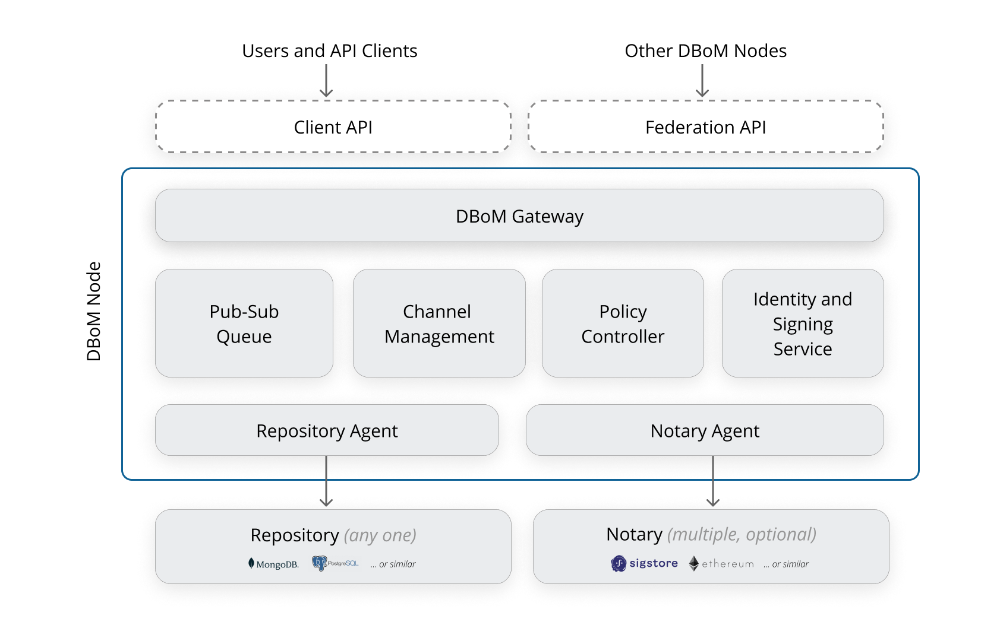

Key Concepts 
============

The Digital Bill of Materials (DBoM) provides the missing layer for policy controlled attestation sharing between organizations.

===================
System Architecture
===================

Each partner or organization needs to instantiate a DBoM node to exchange attestations or information. As shown in the following diagram, an instance of DBoM node consists of the following components:

-	DBoM Gateway
-	Repository Agent (Database Agent)
-   [WIP] Pub-Sub Queue
-   [WIP] Channel Management
-   [WIP] Policy Controller
-   [WIP] Identity and Signing Service
-	[WIP] Notary Agent

.. note::
    The DBoM Gateway and Repository Agent are the only components that are currently implemented in Release `2.0.0-alpha-1`.
    In current release the functionalities like certificate generation, Pub-Sub Queue, Channel Management built in with DBoM Gateway and Repository Agent, but they will be moved to separate micro-services and it's not fully implemented yet.
    Notary Agent, Policy Controller, Identity, Signing Service and other micro-services are planned for future releases.

=======
DBoM Gateway
=======
The “DBoM Gateway” is the single-entry point for all DBoM functionality. Here are the available operations:

Channels
~~~~~~~~
- Create Channel
- List Channels
- Get details of a specific channel
- Add a notary to a channel
- Remove a notary from a channel 

Assets
~~~~~~
- List Assets
- Add an Assets
- Retrieve an Asset
- Update an Asset
- Rich Query Assets
- Query Assets
- Audit trail of an Asset
- Add link to an Asset
- Remove link from an Asset

Federation
~~~~~~~~~~
- Initiate a channel join request (handled automatically)
- List all the requests
- Get details of a specific channel join request
- Accept a channel join request
- Reject a channel join request

.. note::
    The DBoM Gateway is implemented as a REST API. As shown in the high level diagram above, the DBoM Gateway is the only component that is exposed to the outside world. All other components are only accessible via the DBoM Gateway. 
    
    - Users and Clients can interact by using **Client APIs (Port 3050)**
    - Other DBoM Nodes can interact by using **Federation APIs (Port 7205)**

======
Repository Agent (Database Agent)
======
The repository agent is responsible for abstracting CRUD, rich query and list operations for a given data repository. 

======
[WIP] Pub-Sub Queue
======
This is a newly introduced microservice that is responsible for all pub-sub operations.

======
[WIP] Channel Management
======
This is a newly introduced microservice which takes care of maintaining all state related to channel establishment.

======
[WIP] Policy Controller
======
This is a newly introduced microservice that is the single point of control for ACL decisions for any sort of data access on the DBoM.

======
[WIP] Identity and Signing Service
======
This is a newly introduced microservice that takes care of all operations around the cryptographic identity of the DBoM Node.

======
[WIP] Notary Agent
======
The notary agent is responsible for abstracting the “notarization” operation of a notary, including interfacing to key management systems to access secrets (such as private keys, passwords, and wallets), and holding configuration objects such as smart contract addresses.

