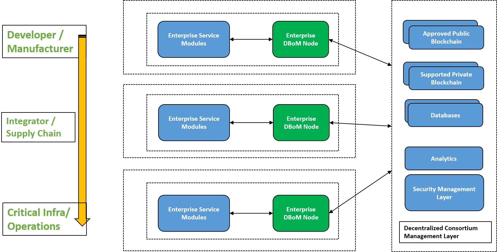
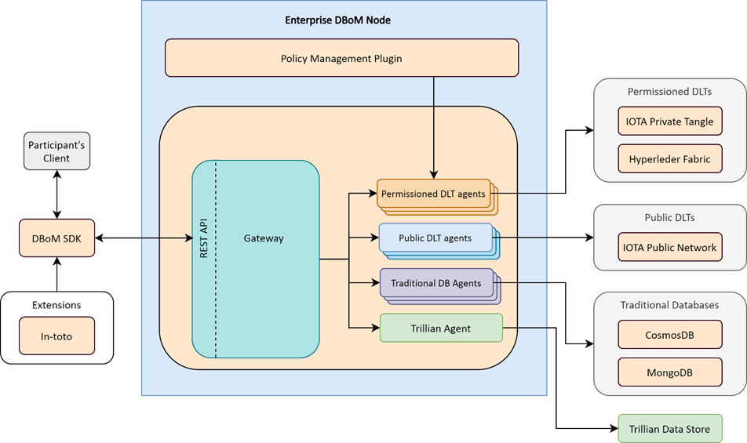

Key Concepts 
============

The Digital Bill of Materials (DBoM) is a solution compromised of software components that allow partners to share attestations through a set of supported repositories such as databases, private and permissioned distributed ledgers or public Blockchains such as Etherium or IOTA.

The main capability provided by DBoM is a common way to set up private or broadcast channels between two or more partners to share information.
As shown in the following diagram, partners exchange information through their DBoM node(s).  

The exchange of information is done through channel(s) that are set up in the repositories. The repositories can be traditional databases such as MongoDB or public and private distributed ledger technologies such as IOTA, Hyperledger-Fabric or Etherium. The choice of repositories are agreed between the partners or mandated by the organization/partner that instantiates it.

As shown in the diagram, each enterprise or partner will all also have one or more service modules that interface to DBoM for recording or retreiving data from the repositories. A DBOM node can interface to more than one type of repository. 
The organizations have the option to run analytics against the data that they share in a channel of a repository.

The security of the information recorded in any channel adhere to the level of security associated with its repository. The data in each channel is only visible to the partners that have subscribed to the channel.

===================
System Architecture
===================

Each partner or organization needs to instantiate a DBoM node to exchange attestations or information. As shown in the following diagram, an instance of DBoM node consists of the following components:
-	DBoM SDK
-	One or more agents that interface to a corresponding repository type. 
-	Gateway
-	Policy Management Plugin (yet to be implemented)

Note:  DBoM Gateway and Agents are 12-factor compliant Microservices

Channels
--------

DBoM provides the concept of Channels for organizations to share information/attestations among themselves. The information recorded on each Channel is only visible to its subscribers. An organization can set up more than one Channel in each repository. The subscribers to each Channel have to also be enabled to have access to its repository. 

There are two types of channels: Private and Broadcast. 

- A *Private channel* is set up by one organization and then subscribed by other organizations/partners that would like to share information through it.  

- A *Broadcast channel* is set up by one organization and then other organizations can subscribe to it to receive information from the originator. Only the owner of the channel can write to the channel. The creator can change the policies on the channel to give write permissions to other subscribers of the channel. 

===
SDK
===

The DBoM SDK allows integrating DBoM node into an existing code. This will facilitate the creation of applications by having the DBoM as a software framework. Currently the SDK will support Windows, Linux and MacOS.

=======
Gateway
=======

The Gateway is the component that manages connections to one or more agents and exposes the following common APIs for asset creation, management and deletion to any type of repositories:

-   Create Asset
-   Update Asset
-   Attach Subasset
-   Detach Subasset
-   Get Asset Audit Trail

The gateway additionally has extension APIs that allow you to:

-   Transfer assets across repositories and channels
-   Export assets with expanded parent and child links as a JSON Tree
-   Validate a signed asset using PKI

For instructions on using these extension APIs, refer to the API Specification or the :ref:`gateway extension APIs tutorial <gw-extension-apis>`.

The main function of the DBoM Gateway include:

- Maintain and validate the connection configuration for its agent(s)
- Convert API calls by its external service users to the correponding calls to corresponding Agent. 
- Validate the semantic structure of the asset being written to the repository by leveraging JSONSchema defined in the REST-Schema folder.  

======
Agents
======

The agents are the components that acts as an abstraction layer, allowing the “Gateway” to interact with any supported DLT or traditional datastore.  
An Agent supports  the following three fundamental operations:

- Commit – Write  data onto a channel under a given recordID
- Query – Read some data from a channel from a given recordID
- Audit (Optional) – Get the log of every operation performed on a recordID that’s present in a channel

The responsibilities of the agent include 

- Maintaining the cryptographic store required to access the DLT
- Maintaining any extra configuration to access channels on that DLT
- Exposing the Commit-Query-Audit (henceforth referred to as CQA)  interface required by the Gateway 

The agent may choose to expose this interface with any protocol supported by the Gateway.

Agents can be created for

- Private DLTs (Eg. Hyperledger Fabric, Corda Enterprise e.t.c)
- Public DLTs (Eg. The IOTA Tangle, Ethereum)
- Traditional Datastores (Eg. MongoDB, PostgreSQL e.t.c)
- Transparency Logs (Eg. Trillian_)

.. _Trillian: https://github.com/google/trillian

==========
Extensions
==========

Extensions allow of other supply chain solutions to store and access data from a DBoM. 

The currently supported extensions are:

- in-toto_

.. _in-toto: https://github.com/in-toto/in-toto

========================
Policy Management Plugin
========================

The current policy that is applied to any subscriber of a channel is Read/Write.

For a more granular management of permissions, a policy management plugin is required for each channel to ensure that they have policies-based accesses by its subscribers. 

.. note::

    This subsection describes functionality that has not yet been implemented in the OSS DBoM Gateway

The plugin will provide a framework for governance of information and attestations.
Policies will be enforced on channels that are created by the Designated Repository Owner (DRO).

The policies are defined as JSON or YAML files and will contain information on access rights for a subscriber of a particular channel.

**Sample response for policy on a channel**

.. code-block:: json

    {
        "channelDescription": "Channel for CompanyA-CompanyB-CompanyC",
        "channelId":"channel_abc",
        "policy":{
            "policyDescription": "Policy Description.",
            "policyVersion": "1.0",
            "accessRights": [
                {
                    "orgId":"company-a.com",
                    "accessLevel":["R","W","A"]
                },
                {
                    "orgId":"company-b.com",
                    "accessLevel":["R","W","A"]
                },
                {
                    "orgId":"company-c.com",
                    "accessLevel":["R","W"]
                }
            ]
        }
    }
