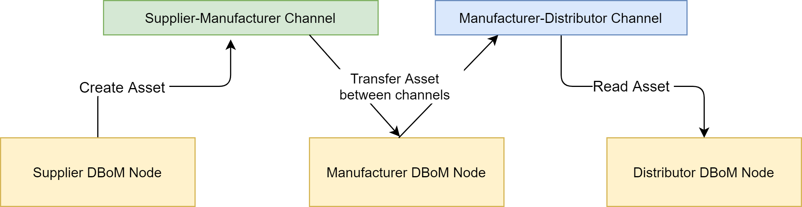
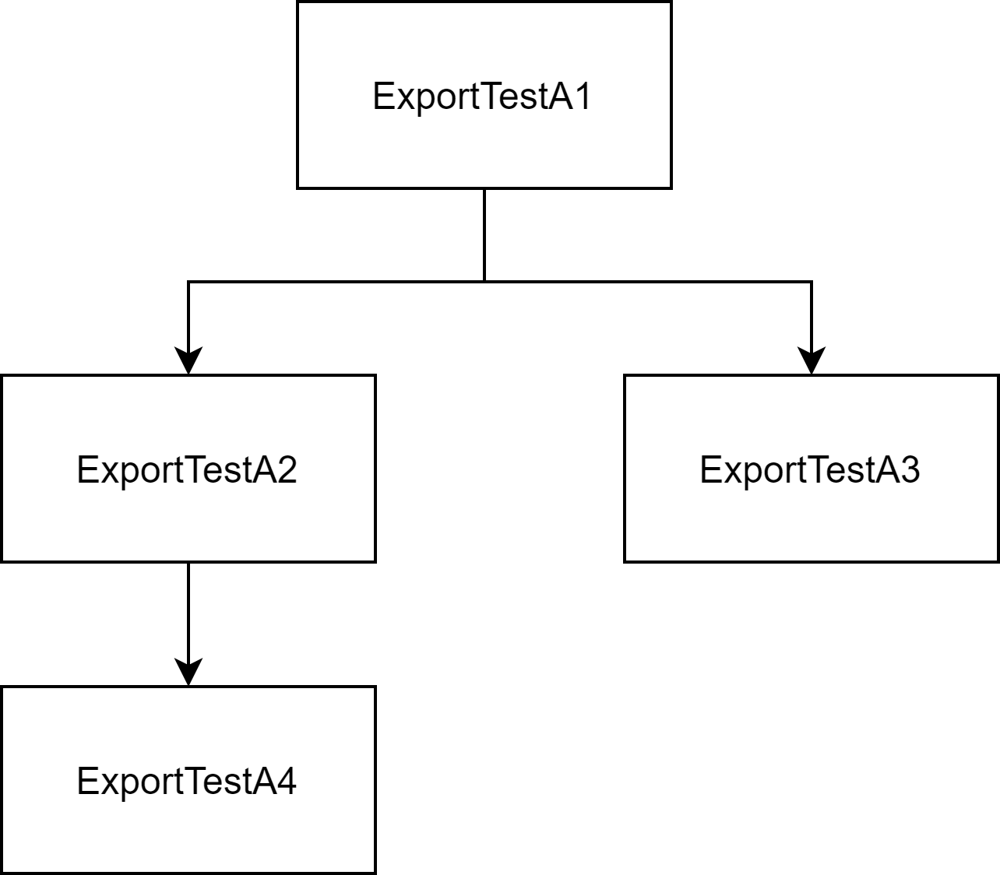

Tutorials 
=========

==================
Configuring Agents
==================

Agents are configured on the Gateway in the PoC by the use of the
agent-config configmap in a Kubernetes environment and agent-config.yaml
when it's being run locally

Example Agent Config
--------------------

.. code-block:: yaml  

    meta:
        version: v1.0
    agents:
        - DB1:
            version: 1
            host: localhost
            port: 3500
            enabled: true
        - iota:
            version: 1
            host: localhost
            port: 4000
            enabled: true
        - hlf:
            version: 1
            scheme: grpc # the OSS doesn't yet support grpc
            host: 10.23.0.1
            port: 3241
            enabled: false

Parameters
----------

- meta: Contains metadata about the configuration
    - **version:** Version of the agentconfig. Currently can only be v1.0
- agents: Collection of available agents, with the key being the repoID
    - **version:** Version of the agent api. Integer, currently 1 exists
    - **scheme** (optional, defaults to http): The protocol over which the agent communicates, currently http is supported.
    - **host:** The hostname/ip-address where we can find the agent
    - **port:** The port on which the agent communicates
    - **enabled:** (optional, defaults to True) Determines if the agent is enabled
    - **supports-audit:** (optional, defaults to True) Determines whether the agent supports the audit API

The agent is configured to automatically reload the agent config if any
changes occur on the configmap or in the file-system

======================
Customized Deployments
======================

This section covers non-default deployment configurations that may be useful when deploying DBoM core services in production or niche use cases

Using TLS and x.509 authentication with MongoDB
-----------------------------------------------

In a production deployment, if you are choosing to use the mongodb repository implementation (database-agent), the recommended way to securely communicate to the repository is to use the built-in TLS support and x.509 user authentication.

This is fairly simple to do as database agent, and the mongodb-audit watcher (which is run by the repository owner) has built in support for mutual TLS authentication and authorization.

To begin with, you will have to configure your mongodb deployment to use tls and x.509 client authentication. The generation of certificates and configuration of the mongodb server is outside the scope of the DBoM documentation.

However, if you want to try out this deployment by creating a local CA which can sign a certificate, follow the official mongoDB documentation:

- `Creating CA Certificates <https://docs.mongodb.com/manual/appendix/security/appendixA-openssl-ca/>`_
- `Creating Certificates for your MongoDB Server <https://docs.mongodb.com/manual/appendix/security/appendixB-openssl-server/>`_
- `Creating Certificates for Mongo clients <https://docs.mongodb.com/manual/appendix/security/appendixC-openssl-client/>`_

You will need to generate multiple client certificates and associated user roles, as follows:

- One for the mongodb-audit-watcher, having read access to your channels collection as well as the ability to listen to change streams
- One for each DBoM node that you want joined to the repository, having appropriate access control to the channel collections

The details for creating these roles are present in the `MongoDB documentation for Users and Roles <https://docs.mongodb.com/manual/tutorial/manage-users-and-roles/>`_ and `x.509 authentication for clients <https://docs.mongodb.com/manual/tutorial/configure-x509-client-authentication/>`_

Once you have configured mongodb with the certificates that you have generated, it is now time to configure the database agent instances and the mongoDB audit watcher appropriately

This is done using environment variables. Set the appropriate environment variables, as specified in the README for `database-agent <https://github.com/DBOMproject/database-agent>`_ and `mongodb-audit-watcher <https://github.com/DBOMproject/mongodb-audit-watcher>`_. If you are using docker, ensure that the certificates that you are providing are available within the container as a volume mount.

.. list-table:: Example Environment Variables
   :header-rows: 1
   :align: center

   * - Key
     - Value   
   * - MONGO_TLS_MODE_ENABLED
     - ``1``
   * - MONGO_TLS_CLIENT_CERT_PATH
     - ``.secrets/client_cert.pem``
   * - MONGO_TLS_CA_CERT_PATH
     - ``.secrets/ca_cert.pem``

If you are using Helm Charts to deploy on Kubernetes, these keys are stored within a secret. Refer to the helm chart READMEs for further details.

=========================
Connecting Multiple Nodes 
=========================

MongoDB (Database Agent)
------------------------

This can be done by configuring the same mongoDB URI for the database-agent deployment for each node, either by using docker environment variables or the appropriate keys in the Kubernetes configmap

Find out more from the the deployment repository:

- `Docker Compose <https://github.com/DBOMproject/deployments/tree/master/docker-compose-quickstart>`__
- `Kubernetes <https://github.com/DBOMproject/deployments/tree/master/charts/database-agent>`__

Ensure that both nodes have the agent configuration correctly set with the same names for the repositories. Access control to channels is facilitated by MongoDB Collection Level Role Based Access Control. Find how that can be setup by referring to the `official MongoDB documentation <https://docs.mongodb.com/manual/core/collection-level-access-control/>`__

IOTA (IOTA MAM Agent)
---------------------

To know more about setting up multiple channels for the IOTA MAM Agent, go to the `official repository <https://github.com/DBOMproject/iota-agent#multi-node-channel-support>`__

.. _gw-extension-apis:

================================
Using The Gateway Extension APIs
================================

In addition to the core create, update, attach, detach and audit APIs, the gateway has extension APIs that provide utility functions. These tutorials guide you through using them

Transfer API
------------

The Transfer API allows you to copy over an asset from one attestation channel to another. This could be useful when you're moving an asset downstream in the supply chain, where entities only have visibility into a limited set of the channels

Pictured above is an example scenario where the "Supplier-Manufacturer" channel's policy restricts it to be read by just the supplier and the manufacturer. 

If the manufacturer wanted to share this asset downstream with the distributor, they can transfer it to the "Manufacturer-Distributor" channel, whose policies allow the distributor to read it

When a transfer occurs, the metadata required to find the transfer destination and source are embedded into the asset payload. This allows you to track the asset's audit trail throughout it's lifetime

Using the REST API
^^^^^^^^^^^^^^^^^^

Import the `postman files for the Gateway <https://github.com/DBOMproject/api-specs/tree/master/gateway/postman>`__ to experiment with the REST API.

Open up the postman collection and navigate to the "Transfer an Asset" request. Enter your parameters for repo ID, channel ID and asset ID (source) into the http parameters tab

When you navigate to the "body" tab, you will see the following payload 

.. code-block:: json

    {
        "transferDescription": "...",
        "repoID": "...",
        "channelID": "...",
        "assetID": "..."
    }

The ``repoID``, ``channelID`` and ``assetID`` referred to in the body must be replaced with the destination repo, channel and asset id that you want the asset to assume after the transfer operation. You can also provide a ``transferDescription`` to provide context for the transfer operation

Once transferred, the source and destination assets will be amended with a ``custodyTransferEvents`` JSON array, which reflects all the transfer events that have occured on the asset. As this is part of the asset payload, it is immutably reflected in the asset audit trail. 

.. note::

    By default, the source asset is also marked 'read-only' by the gateway.

If you retrieve the destination or source asset that you transferred right now, you'll find the following key added to the asset payload:  

.. code-block:: json

    "custodyTransferEvents ": [
            {
                "timestamp": "2021-03-22T11:22:14.589Z",
                "transferDescription": "moved",
                "sourceRepoID": "DB1",
                "sourceChannelID": "C1",
                "sourceAssetID": "ABC02",
                "destinationRepoID": "DB1",
                "destinationChannelID": "C2",
                "destinationAssetID": "ABC02"
            }
        ],

This event tells the requestor that this asset was moved from DB1,C1 to DB1,C2 at the shown timestamp with the description "moved". The presence of this event on the asset can be used in your applications to recursively retrieve the state of the asset across multiple channels in order to trace and establish provenance of the asset.

Transfer Policies
^^^^^^^^^^^^^^^^^^
.. note::

    This subsection describes functionality that has not yet been implemented in the OSS DBoM Gateway

There are cases where you would want to mark assets on a channel as being transferrable only if it meets the criteria set by channel-wide or asset-specific policies. 

This is where transfer policies come in. They allow you to set channel wide or asset specific policies for transfer including 

- the ability to disable transfers altogether
- controlled transfers that are limited to specific repositories and channels 

Channels will have a default transfer policy, which will apply to all assets that don't have an explicit channel policy specified, however if the asset references a specific policy as part of the asset metadata, that policy will override the default policy set at the channel level

Export API
------------

The export api lets you retrieve an entire asset tree from the DBoM (i.e. including all parent and child assets). This could be useful if you are moving an asset and all associated sub assets into another system for processing

Take an example where you create a bunch of assets and attach them as shown below.

If you wanted to export these assets out at once into another system, you can run export on any of these assets and the entire tree will be returned as JSON.

For instance, let's say we try exporting `ExportTestA1`, we will get a JSON payload with all its children upto the leaf level (i.e `ExportTestA2`, `ExportTestA3` and `ExportTestA4`). 
However, if we try to export `ExportTestA2`, we will get all children and direct ancestors (i.e `ExportTestA1` and `ExportTestA4`) 