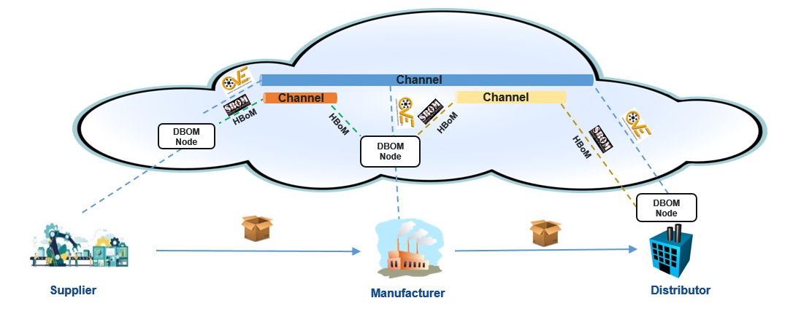

Use Cases
=========

Software Bill of Materials
--------------------------

Recently, there has been a sharp uptick in supply chain attacks. They are an emerging class of threats that target software developers and suppliers. They are usually orchestrated by APT (Advanced Persistent Threat) groups who have massive technical and financial resources at their disposal and their goal is to access source code, affect build processes/update mechanisms by infecting legitimate apps to distribute malware. A large part of preventing these attacks involve developing stringent security hygiene practices that requires organizations to know the exact dependencies, origin and provenance of their software assets, which is where Software Bill of Materials (SBOM) comes in. The SBOM associated with a software could be thought of as an ingredient list that gives out the context needed to assess the trustworthiness of a given piece of software. It is a concept that nation-level entities are planning to mandate to improve software security (see: `US Cybersecurity EO <https://www.whitehouse.gov/briefing-room/presidential-actions/2021/05/12/executive-order-on-improving-the-nations-cybersecurity/>`__)

SBOMs can also be used as an input to automate enterprise compliance processes such as license & attribution checks. However, adopting SBOMs effectively across organizational boundaries is a daunting task that presents several challenges: 

- Lack of a uniform and automated platform for SBOM Sharing
    For SBOMs to be effective, they must be shared seamlessly across organizational boundaries, and they must be kept up to date, to always accurately represent the software that they are describing. The best way to achieve this is to integrate the SBOM creation, publishing, and consumption into the software lifecycle. However, this is a challenging task as there is no established platform for seamlessly sharing these types of information  

- Vendor and format lock in 
    There are a variety of SBOM formats in the market (SPDX, SWID, CycloneDX e.t.c). This causes fragmentation, where different organizations could have different preferred formats for use internally. Hence it is important to be able to seamlessly convert between these formats. Interoperability between these well-known standards is a challenge due to their disparate nature. 

- Permissioned and auditable sharing is difficult 
    From a security standpoint, it is important for an SBOM sharing platform to have built in primitives for establishing the provenance and granularly controlling access to the shared SBOMs. This is because SBOMs sometimes contain manifest data that organizations do not want to put out in the open 

Attestation Channels and the DBoM
^^^^^^^^^^^^^^^^^^^^^^^^^^^^^^^^^

Attestation channels are a policy-controlled distribution mechanism for artifacts in the form of **attestations** which describe some physical or virtual entity that exists within the supply chain. Examples of such attestations could include descriptions of these artifacts (like software bills of materials (SBOMs)) as well as process outcomes (like the results of a vulnerability scan) 

DBoM or the **Digital Bill of Materials** is a framework of tools and services that enable these attestations to be created, addressed, retrieved, and passed down the supply chain over attestation channels, while also ensuring the nonrepudiation and auditability of the published attestations. This framework enables end to end automation of supply chain workflows

The figure shows how DBoM nodes can be hosted in the cloud or on premises. In this example, the participants in a supply chain have established various attestation channels to share policy-based complementary metadata such as Software Bill of Materials (SBOM), Hardware Bill of Materials (HBOM) and CVEs (Common Vulnerabilities and Exposures). Their permissioned nature allows granular control over data access. In this example, a channel (blue color) is configured between three participants by which all three have subscribed to it. The CVEs that are recorded on the channel by any subscriber are accessible by any other subscribers of that channel. At the same time, the orange and yellow color channels act as a private stream between the individual participants where they may exchange sensitive attestations like privileged SBOMs and HBOMs. 

This secure attestation channel scheme allows for a decentralized root of trust for the participants and provides an opportunity for third party vendors to enrich and create metadata or attestations that would otherwise be difficult to incorporate in an approach where the metadata comes bundled with the packages. 

The DBoM node provides a simple to use REST API, which is used by the open-source SDK to allow for seamless integration. The SDK also enables on-the-fly interchange between attestation formats. For instance, an SBOM that was published in the SPDX format can be retrieved by client applications as a SWID SBOM

The Future of Software Attestation Sharing
^^^^^^^^^^^^^^^^^^^^^^^^^^^^^^^^^^^^^^^^^^

The Digital Bill of Materials introduces a platform where SBOMs can be shared in a uniform manner, supported by a framework of tools and services that enable automation. The core design that focuses on interoperability makes it easy to switch between diverse types of repositories and attestation formats, helping organizations overcome vendor lock in 
This ease of use is coupled with strong permission controls and auditability that enable organizations to granularly control distribution of sensitive data, while ensuring provenance of every attestation. This framework will enable organizations to seamlessly integrate SBOMs into their software lifecycle processes, and help ensure software supply chain security at scale

Interesting links to more material on SBOMs:

- `Minimum Elements of an SBOM - National Telecommunications and Information Administration <https://www.ntia.doc.gov/report/2021/minimum-elements-software-bill-materials-sbom>`__

